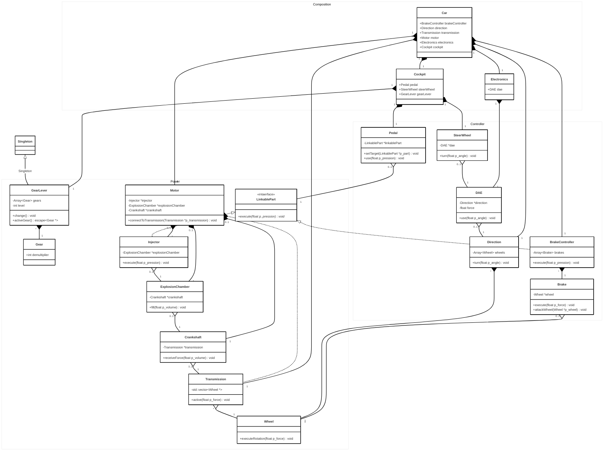

```mermaid
---
config:
  theme: neo
---

classDiagram
    direction TB

    namespace Composition {
        class Car
        class Cockpit
        class Electronics
    }

    namespace Controller {
        class Pedal
        class SteerWheel
        class DAE
        class Direction
        class BrakeController
        class Brake
    }

    namespace Power {
        class Motor
        class Wheel
        class GearLever
        class Gear
        class Injector
        class ExplosionChamber
        class Crankshaft
        class Transmission
        class LinkablePart
    }

    GearLever "*" *-- "1" Gear

    Singleton <|-- GearLever : Singleton<GearLever>

    ExplosionChamber "0..1" o-- "1" Crankshaft
    Crankshaft "0..1" o-- "1" Transmission
    Transmission "*" o-- "1" Wheel

    Injector "0..1" o-- "1" ExplosionChamber

    LinkablePart <|.. Injector
    LinkablePart <|.. BrakeController

    Motor "0..1" *-- "1" Injector
    Motor "0..1" *-- "1" ExplosionChamber
    Motor "0..1" *-- "1" Crankshaft
    Motor *.. Transmission

    Pedal "0..1" o-- "1" LinkablePart

    Direction "*" *-- "1" Wheel

    DAE "0..1" o-- "1" Direction

    SteerWheel "0..1" o-- "1" DAE

    Brake "0..1" o-- "1" Wheel

    BrakeController "*" *-- "1" Brake

    Cockpit "1" *-- "1" Pedal
    Cockpit "1" *-- "1" SteerWheel
    Cockpit "1" *-- "1" GearLever

    Electronics "1" *-- "1" DAE

    Car "1" *-- "1" BrakeController
    Car "1" *-- "1" Direction
    Car "1" *-- "1" Transmission
    Car "1" *-- "1" Motor
    Car "1" *-- "1" Electronics
    Car "1" *-- "1" Cockpit

    class LinkablePart {
        <<intaerface>>
        +execute(float p_pression)* void
    }

    class Wheel {
        +executeRotation(float p_force) void
    }

    class Gear {
        +int demultiplier
    }

    class Singleton {
    }

    class GearLever {
        -Array~Gear~ gears
        -int level
        +change() void
        +activeGear() escape~Gear *~
    }

    class Transmission {
        -std::vector~Wheel *~
        +active(float p_force) void
    }

    class Crankshaft {
        -Transmission *transmission
        +receiveForce(float p_volume) void
    }

    class ExplosionChamber {
        -Crankshaft *crankshaft
        +fill(float p_volume) void
    }

    class Injector {
        -ExplosionChamber *explosionChamber
        +execute(float p_pression) void
    }

    class Motor {
        -Injector *injector
        -ExplosionChamber *explosionChamber
        -Crankshaft *crankshaft
        +connectToTransmission(Transmission *p_transmission) void
    }

    class Pedal {
        -LinkablePart *linkablePart
        +setTarget(LinkablePart *p_part) void
        +use(float p_pression) void
    }

    class Direction {
        -Array~Wheel~ wheels
        +turn(float p_angle) void
    }

    class DAE {
        -Direction *direction
        -float force
        +use(float p_angle) void
    }

    class SteerWheel {
        -DAE *dae
        +turn(float p_angle) void
    }

    class Brake {
        -Wheel *wheel
        +execute(float p_force) void
        +attackWheel(Wheel *p_wheel) void
    }

    class BrakeController {
        -Array~Brake~ brakes
        +execute(float p_pression) void
    }

    class Cockpit {
        +Pedal pedal
        +SteerWheel steerWheel
        +GearLever gearLever
    }

    class Electronics {
        +DAE dae
    }

    class Car {
        +BrakeController brakeController
        +Direction direction
        +Transmission transmission
        +Motor motor
        +Electronics electronics
        +Cockpit cockpit
    }
```
