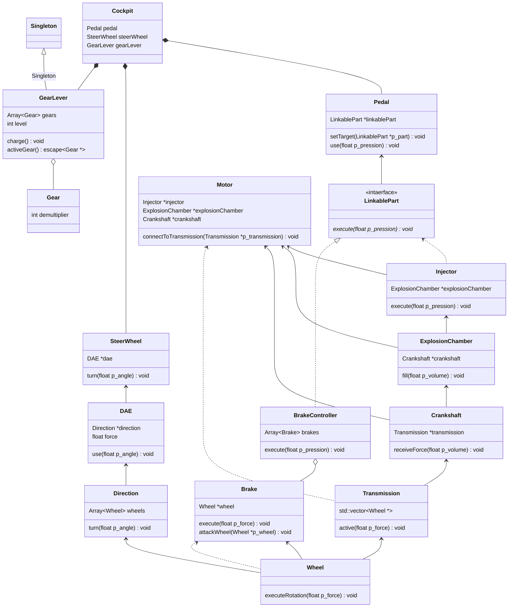

```mermaid
classDiagram
    direction TB

    GearLever o-- Gear

    Singleton <|-- GearLever : Singleton<GearLever>

    ExplosionChamber <-- Crankshaft
    Crankshaft <-- Transmission
    Transmission <-- Wheel

    Injector <-- ExplosionChamber

    LinkablePart <.. Injector
    LinkablePart <|.. BrakeController

    Motor <-- Injector
    Motor <-- ExplosionChamber
    Motor <-- Crankshaft
    Motor <.. Transmission

    Pedal <-- LinkablePart

    Direction <-- Wheel

    DAE <-- Direction

    SteerWheel <-- DAE

    Brake <-- Wheel
    Brake <.. Wheel

    BrakeController o-- Brake

    Cockpit *--Pedal
    Cockpit *--SteerWheel
    Cockpit *--GearLever

    class LinkablePart {
        <<intaerface>>
        execute(float p_pression)* void
    }

    class Wheel {
        executeRotation(float p_force) void
    }

    class Gear {
        int demultiplier
    }

    class Singleton {
        %% TODO
    }

    class GearLever {
        Array~Gear~ gears
        int level
        charge() void
        activeGear() escape~Gear *~
    }

    class Transmission {
        std::vector~Wheel *~
        active(float p_force) void
    }

    class Crankshaft {
        Transmission *transmission
        receiveForce(float p_volume) void
    }

    class ExplosionChamber {
        Crankshaft *crankshaft
        fill(float p_volume) void
    }

    class Injector {
        ExplosionChamber *explosionChamber
        execute(float p_pression) void
    }

    class Motor {
        Injector *injector
        ExplosionChamber *explosionChamber
        Crankshaft *crankshaft
        connectToTransmission(Transmission *p_transmission) void
    }

    class Pedal {
        LinkablePart *linkablePart
        setTarget(LinkablePart *p_part) void
        use(float p_pression) void
    }

    class Direction {
        Array~Wheel~ wheels
        turn(float p_angle) void
    }

    class DAE {
        Direction *direction
        float force
        use(float p_angle) void
    }

    class SteerWheel {
        DAE *dae
        turn(float p_angle) void
    }

    class Brake {
        Wheel *wheel
        execute(float p_force) void
        attackWheel(Wheel *p_wheel) void
    }

    class BrakeController {
        Array~Brake~ brakes
        execute(float p_pression) void
    }

    class Cockpit {
        Pedal pedal
        SteerWheel steerWheel
        GearLever gearLever
    }
```
