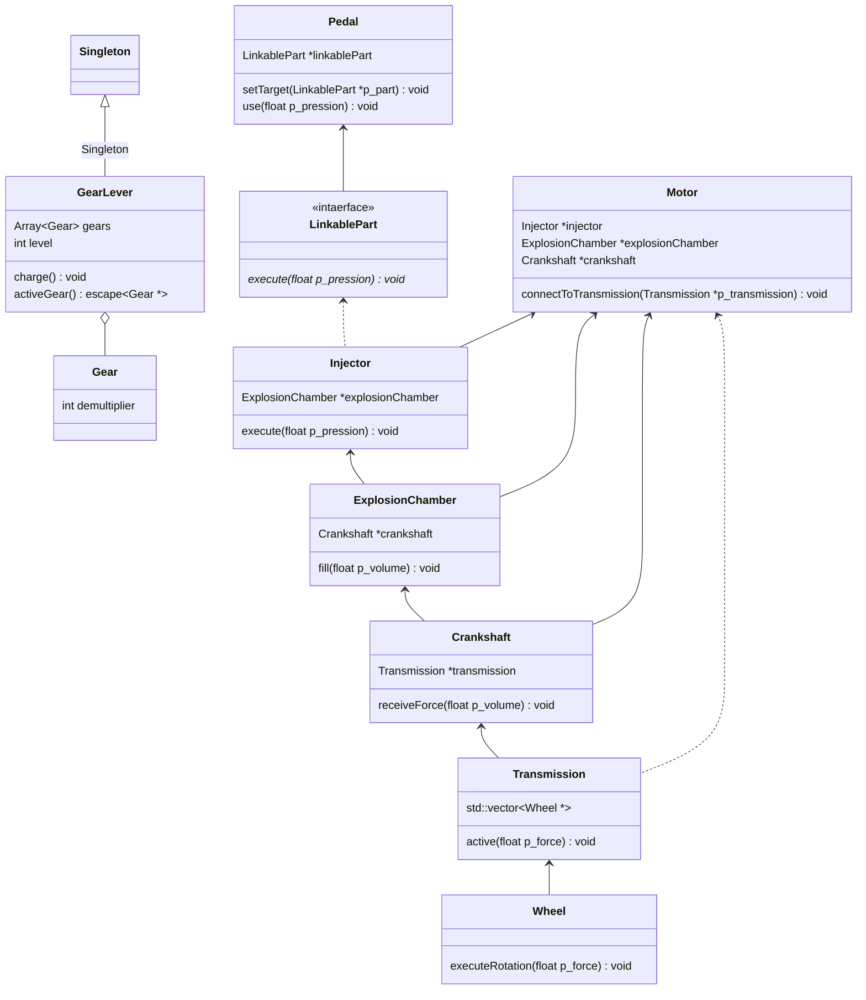

```mermaid
classDiagram
    direction TB

    GearLever o-- Gear

    Singleton <|-- GearLever : Singleton<GearLever>

    ExplosionChamber <-- Crankshaft
    Crankshaft <-- Transmission
    Transmission <-- Wheel

    Injector <-- ExplosionChamber
    LinkablePart <.. Injector

    Motor <-- Injector
    Motor <-- ExplosionChamber
    Motor <-- Crankshaft
    Motor <.. Transmission

    Pedal <-- LinkablePart

    class LinkablePart {
        <<intaerface>>
        execute(float p_pression)* void
    }

    class Wheel {
        executeRotation(float p_force) void
    }

    class Gear {
        int demultiplier
    }

    class Singleton {
        %% TODO
    }

    class GearLever {
        Array~Gear~ gears
        int level
        charge() void
        activeGear() escape~Gear *~
    }

    class Transmission {
        std::vector~Wheel *~
        active(float p_force) void
    }

    class Crankshaft {
        Transmission *transmission
        receiveForce(float p_volume) void
    }

    class ExplosionChamber {
        Crankshaft *crankshaft
        fill(float p_volume) void
    }

    class Injector {
        ExplosionChamber *explosionChamber
        execute(float p_pression) void
    }

    class Motor {
        Injector *injector
        ExplosionChamber *explosionChamber
        Crankshaft *crankshaft
        connectToTransmission(Transmission *p_transmission) void
    }

    class Pedal {
        LinkablePart *linkablePart
        setTarget(LinkablePart *p_part) void
        use(float p_pression) void
    }
```
